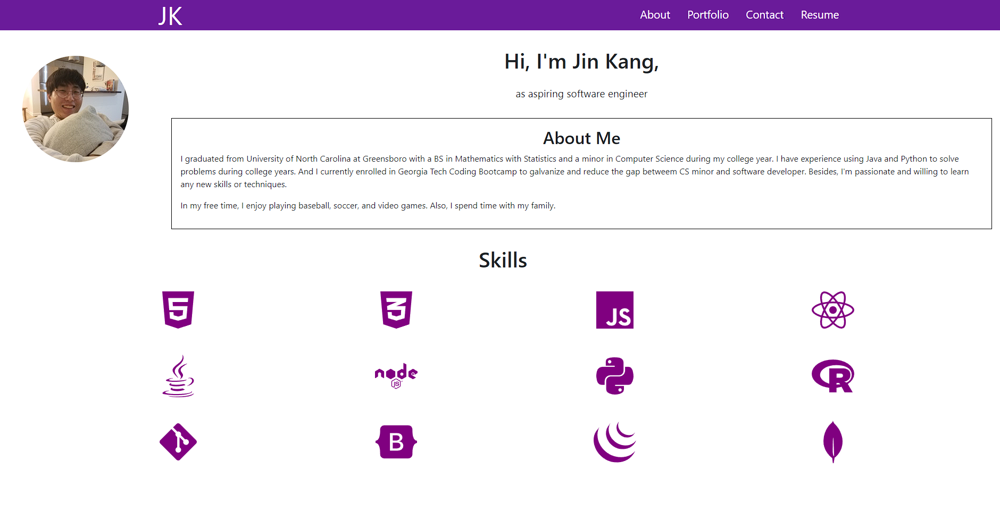

# React-Portfolio

A responsive online portfolio using React

## Description
- Portfolio has 3 sections: header, a section for content, and a footer
- Header has developer's name and navigation bar
- Section displays differently when the title on the navigation bar is clicked.
- Applied introduction of me in the About section.
- Uploaded 6 projects done during the course in the Portfolio section
- Created a contact form where each field is required to be filled up in the Contact section.
- Uploaded my resume and displayed my Web developement skills in the Resume section.

## Link to a deployed portfolio
[React Portfolio](https://kbjss071.github.io/React-Portfolio/)

## Installation
To install all dependencies, please run the following command `npm i`

## Usage
After the installation of dependencies, please run the following command `npm start` or click the link above for the deployed application.

## Contributing
No contribution is needed at this moment.

## Questions
Please feel free to reach out to me at kbjss071@gmail.com